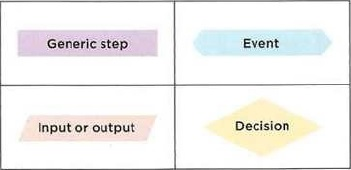
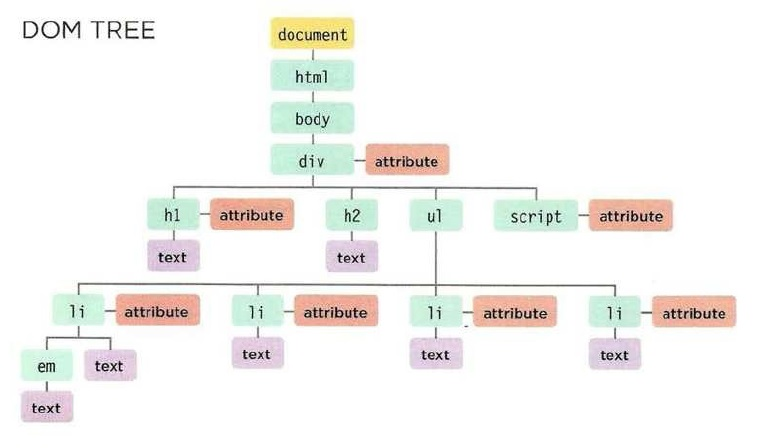
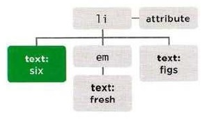
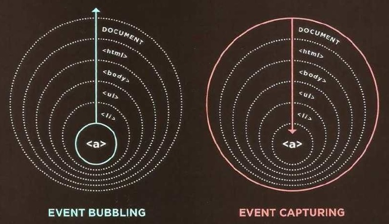

# JAVASCRIPT & JQUERY (Jon Duckett)

<a id="indice"></a>

1. [THE ABC OF PROGRAMMING](#cap-1)
1. [BASIC JAVASCRIPT INSTRUCTIONS](#cap-2)
1. [FUNCTIONS, METHODS & OBJECTS](#cap-3)
1. [DECISIONS & LOOPS](#cap-4)
1. [DOCUMENT OBJECT MODEL (DOM)](#cap-5)
1. [EVENTS](#cap-6)

- Mientras se está usando la página.
    - **Access** al contenido de la página.
    - **Modify** el contenido de la página.
    - **Program** reglas para el navegador.
    - **React** a eventos desencadenados por el usuario.
- Examples:
    - Slideshows.
    - Forms.
    - Reload part of page.
    - Filtering data.
- HTML Elements:
    - Opening tag: `<p class="fruit">`
    - Closing tag: `</p>`
    - Attribute name: `class`
    - Attribute value: `fruit`

    ```html
    <p class="fruit"> peach </p>
    ```

- CSS Rules:
    - Selector: `.fruit`
    - Declaration block: `{color: pink;}`
    - Property name: `color`
    - Property value: `pink`

    ```css
    .fruit {color: pink;}
    ```

[Ir al índice][indice]

<a id="cap-1"></a>

## 1. THE ABC OF PROGRAMMING

### a. What is a script and how do I create one?

- Serie de instrucciones, como: Recetas, manuales, instructivos, ...
- **Definir** objetivo > **Diseñar** el script > **Escribir** el código. (Dividir en partes el problema, diagrama de flujos)
- Aprender un lenguaje de programación:
    - **Vocabulary**
    - **Syntax**
    - **Think** programmatically
- **Flowchart**:
    - Event
    - Generic step
    - Input or output
    - Decision
    - 

### b. How do computers fit in with the world around them?

- **Objects**: Types and instances.
    - **Properties**: Name - Value.
    - **Events**: Something is happening.
    - **Methods**: About or change propertie of objets.
    - Event > Method > Property.
- **Window** object: Ventana del navegador.
- **Document** object: Página mostrada.
    - Properties: `URL`, `lastModified`, `title`.
    - Events: `load`, `click`, `keypress`.
    - Method: `write()`, `getElementById()`.
- Web } Sites } Web pages (Document)
    - **Document**: **Nodos** (Elementos, textos, atributos), un tipo de objeto.
        1. Almacena en memoria.
        1. Renderiza.
    - Browser: **Interpreter** (or scripting engine).
        - **JavaScript**: Interpreted programming language.

### c. How do I write a script for a web page?

- **Layers** (En archivos separados):
    - De contenido `HTML` estructura y semántica. (**Content**)
    - De presentación `CSS`. (**Presentation**)
    - De comportamiento `JS` interactividad. (**Behavior**)
- Variedad de dispositivos: Tamaños, velocidades de conexión y capacidades. Garantizar el funcionamiento en cada etapa (HTML, CSS, JS).
- **Progressive enhancement**:
    1. HTML.
    1. HTML + CSS (El mismo estilo para toda la página: más rápido de cargar y mantener).
    1. HTML + CSS + JS (Lo mismo para JS).
- **Carpeta**: js, javascript or scripts.
- Los scripts no alteran el código HTML original.
- Recomendable antes de `</body>`.

```html
<script src="script.js"></script>
```

- El script carga donde sea escrito.
- `object.method(parameters);`
    - Member operator: `.` (Métodos y propiedades del miembro)

```javascript
// Método simple de escribir pero no siempre el mejor.
document.write("...");
```

[Ir al índice][indice]

<a id="cap-2"></a>

## 2. BASIC JAVASCRIPT INSTRUCTIONS

- `Statements` (Declaraciones) `;` (Semicolon) `{}` Curly braces (Code block)
- **Case sensitive**: Variables distinguen mayúsculas de minúsculas.

```javascript
/* Comments:
 *
 * Multi-line comment:
 * Descripciones o cómo funciona el script.
 */

// Single-line comment:
// Descripciones cortas o qué está haciendo el código.
```

- Declarar variable:
    - Variable keyword: `var`
    - Variable name (Identifier): `name`
- Con varias palabras: **camelCase**.
- El nombre debería describir el tipo de dato almacenado.
- Si no es asignado un valor, es **`undefined`**.

```javascript
var name;
```

- Asignar valor:
    - Assignment operator: `=`
    - Variable value: `10`

```javascript
name = 10;
```

- Data types:
    - **Numeric**: `-0.75`
    - **String**: `'Quotes'`
    - **Boolean**: `true` or `false`
    - **Arrays**
    - **Objects**
    - **`undefined`**
    - **`null`**
- Usar: `"..."` or `'...'`
- Usar: `"...'...'..."` or `'..."..."...'` or **escaping**: `"...\"...\"..."`
- Strings deben ser escritos en **sólo una línea**.

```javascript
var element = document.getElementById('id');

element.textContent = '...';
element.innerHTML = '...'; // Puede ser riesgoso usar .innerHTML en algunos casos
element.className = '...';
```

- Acortar la declaración y asignación de variables puede hacer el código más dificil de seguir.
- **Reglas** para nombrar variables:
    1. Iniciar con `letra` ó `$` ó `_` (Nunca con número).
    1. Puede contener `letras`, `números`, `$` o `_` (No `-` or `.`).
    1. No usar keywords o reserved words.
    1. Sensible a mayúsculas. **Mala práctica** tener dos variables que se diferencien sólo por mayúsculas.
    1. Que describa el tipo de dato almacenado.
    1. Para varias palabras: **camelCase** or **word_word**

```javascript
/* ARRAYS
 * Los datos pueden ser de diferentes tipos.
 */
var array1 = ['...', '...', '...', ...];    // Array literal
var array2 = ['...',
              '...',
              '...']
var array3 = new Array('...', ...);         // Array constructor

array1.item(10);    // Es equivalente a
array1[10];         // Index: 10

array1.length;      // Número de elementos
```

- **Expressions**, **Operators**:

Tipo | Símbolo
:---|:---
**Assignment** operators|`=`
**Arithmetic** operators|`+` , `-` , `/` , `*` , `++` , `--` , `%`
**String** operators|`+` (Concatenation)
**Comparison** operators|`>` (Retornan `true` or `false`)
**Logical** operators|`&&` (Retornan `true` or `false`)

- **Concatenation**:
    - Números + Strings = Strings
    - Números + Strings con operadores aritméticos = **`NaN`** (Not a Number)

[Ir al índice][indice]

<a id="cap-3"></a>

## 3. FUNCTIONS, METHODS & OBJECTS

### FUNCTIONS

- Calling the function, parameters, return value, anonymous functions.
- Function declaration:
    - Function keyword: `function`
    - Function name (Identifier): `nameFunction`
    - Code block (In curly braces): `{...}`
- Se puede declarar una función antes o después de ser llamada.

```javascript
function nameFunction()
{ 
    // code...
}
```

- Calling a function:
    - **Parámetros** (Declaración)
    - **Argumentos** (Al llamar)

```javascript
nameFunction();
nameFunctionParameters(parameter1, parameter2, ...);
```

```javascript
function nameFunction()
{ 
    // code...
    return variable;    // La función termina cuando retorna un valor
    return array;       // Para retornar varios valores
}
```
- **Named functions**: Se pueden llamar antes o después de la declaración.
- **Anonymous functions**:
    - **Function expression**: Cuando se declara una función donde se espera una expresión.
    - Generalmente se omite el nombre.
    - No se pueden llamar o alterar antes de la declaración.

```javascript
var name = function()
{
    // code...
}

name();
```

- **IIFE** ("iffy", Inmediataly Invoked Function Expressions)
    - **Grouping operators** (Paréntesis inicial y final): Tratan la función como una expresión.
    - **Final parentheses** (Después de la llave final): Llaman a la función.

```javascript
var name = (function()
{
    // code...
}());
```

- Usos:
    - Como un argumento cuando una función es llamada.
    - Asignar valor de una propiedad a un objeto.
    - In Event handlers and listeners.
    - Evitar conflictos entre dos scripts que pueden usar los mismos nombres de variable.
- **Variable scope**:
    - **Local**: Dentro de función, al terminar la variable es destruida.
    - **Global**: Fuera de una función, ocupa espacio en memoria mientras la página esté cargada.
- Preferible usar variables locales. (Sino página lenta con muchas variables globales)
- Si se declara sin `var`, es global scope. (**Mala práctica**)
- Puede haber conflicto de variables globales al usar más de un script en la página.

### OBJECTS

- Variable = **Property**
- Función = **Método**

```javascript
// Literal notation (Propiedades y métodos separados por coma ,)
var objectName = {
    // Properties 
    // key: value,
    name: 'Example',
    // Methods
    // key: function(){...}
    functionName: function()
    {
        this.name = 'Un valor x'; // Member operator: .
    }
};

var almacen = objectName.name;      // Dot notation
var almacen = objectName.functionName();

var almacen = objectName['name'];   // No para métodos.
                                    // Para usar una variable en vez de la propiedad.
                                    // Cuando el nombre de la propiedad es un número. (Evitarlo)
```

```javascript
// Constructor notation
// Object(): Constructor function
var objeto = new Object();

// Añadir o modificar
// También para uno creado con notación literal
objeto.propiedad = 'valor';
objeto.metodo = function() {...};

// Borrar
delete objeto.propiedad;

// Limpiar
objeto.propiedad = '';
```

```javascript
// Empty object
// Crea un objeto vacío
var objeto = {};
```

- Template:
    - Al añadir, modificar o borrar propiedades de un objeto creado por la función constructor, sólo ocurre en ese objeto, no en los demás creados ni en la plantilla.

```javascript
// Función constructor
// Iniciar nombre con mayúscula (Recomendado)
function NombreObjeto(propiedad1, propiedad2, ...)
{
    this.propiedad1 = propiedad1;
    // code...
    this.metodo = function()
    {
        // code...
    };
}

var objeto = new NombreObjeto(valor1, valor2, ...);
```

- **`this`**:
    - Dentro de una función, referencia al objeto donde la función es creada.
    - Las variables globales se convierten en propiedades de window object: `this.variable`
    - En una función dentro de otra función depende del navegador, mejor almacenar el primer `this` en una variable.
- En global context: Referencia a window object.
- En method: Referencia al object.
- En una función que luego es usado como método: Referencia al object.

---

- **Variables**: name/value pairs
- **Arrays**: key/value ~= index/value
- Objetos con **notación literal**:
    - Almacenar, transmitir datos entre aplicaciones.
    - Objetos globales o de configuración que organizan, configuran información de la página.
- Objetos con **constructor**:
    - Muchos objetos con funcionalidad similar en la página.
    - Para un objeto complejo que puede no ser usado en el código.

---

- Arrays son objetos.
- Arrays in a object:

```javascript
var costs = {room1: items[420, 40, 10], ...};

costs.room1.items[0] // <> 420 
```

- Objects in an array:

```javascript
var costs = [{accom: 420, food: 40, phone: 10}, ...];

costs[0].phone // <> 10
```

### BUILT-IN OBJECTS

- Browser object model: Navegador tab/window.
- Document object model: Página web.
- Global JavaScript objects: Generales del lenguaje.
- **Object model**: a group of objects (Que representan algo mayor).
- Objetos dentro de otros objetos: Child object.
- **Browser object model**: `Window` (Current browser window or tab)
    - Document (Current web page).
    - History (Pages in browser history).
    - Location (URL of current page).
    - Navigator (Information about browser).
    - Screen (Device's display information).
- **Document object model** (DOM):
    - document:
        - `<html>`:
            - `<head>`
            - `<body>`
                - etc...
- **Global JavaScript objects**: (Not a model)
    - Basic data types:
        - `String`
        - `Number`
        - `Boolean`
    - Real-world concepts:
        - `Date`
        - `Math`
        - `Regex`

---

- **WINDOW OBJECT**

Property | Description
:---|:---
`window.innerHeight`|Altura de ventana en píxeles.
`window.innerWidth`|Ancho de ventana en píxeles.
`window.pageXOffset`|Distancia que ha sido escroleada en horizontal (En píxeles).
`window.pageYOffset`|Distancia que ha sido escroleada en vertical (En píxeles).
`window.screenX`|Coordenada X del cursor, relativo a esquina superior izquierda (En píxeles).
`window.screenY`|Coordenada Y del cursor, relativo a esquina superior izquierda (En píxeles).
`window.location`|Actual URL de la página (o archivo local).
`window.document`|Página web.
`window.history`|Historial.
`window.history.length`|Número de items en el historial.
`window.screen`|Pantalla.
`window.screen.width`|Pantalla (En píxeles).
`window.screen.height`|Pantalla (En píxeles).

Method | Description
:---|:---
`window.alert()`|Cuadro de diálogo. Mensaje como parámetro. OK para cerrar.
`window.open()`|Nueva ventana. URL como parámetro (No funciona con pop-up blocking).
`window.print()`|Imprimir.

- **DOCUMENT OBJECT**

Property | Description
:---|:---
`document.title`|Título del actual documento.
`document.lastModified`|Hora y fecha de la última modificación del documento (Del archivo HTML).
`document.URL`|Devuelve string con URL del actual documento.
`document.domain`|Devuelve el dominio del actual documento.

Method | Description
:---|:---
`document.write()`|Escribe texto al documento.
`document.getElementById()`|.
`document.querySelectorAll()`|Devuelve una lista de elementos correspondientes al CSS selector.
`document.createElement()`|.
`document.createTextNode()`|.

- **STRING OBJECT**
- Global object & wrapper object.
- Se puede usar en cualquier `string` de variables u objetos.

Property | Description
:---|:---
`.length`|Número de caracteres (Existen algunos que usan dos unidades de código).

Method | Description
:---|:---
`.toUpperCase()`|Mayúsculas.
`.toLowerCase()`|Minúsculas.
`.charAt()`|Parámetro: Índice. Devuelve el caracter en esa posición.
`.indexOf()`|Devuelve el índice del caracter(es) encontrado por primera vez.
`.lastIndexOf()`|Devuelve el índice del caracter(es) encontrado por última vez.
`.substring()`|Devuelve caracteres entre dos índices. El primero incluido, el otro no.
`.split()`|Devuelve un array, corta la cadena en el caracter dado.
`.trim()`|Quita los espacios en blanco al inicio o final de la cadena.
`.replace()`|Busca y reemplaza un valor dado (Por defecto sólo al primero encontrado).

- Tipos de datos:
    - Simple or primitive data:
        - Objects:
            1. **String**
            1. **Number**
            1. **Boolean**
        - No objects:
            1. **`Undefined`** (Variable declarada pero sin valor todavía)
            1. **`Null`** (Variable sin valor)
    - Complex data:
        1. **Object** (Arrays, functions) (Functions are callable)

- **NUMBER OBJECT**
- Integer - Real number - Floating point number - Scientific notation

Method | Description
:---|:---
`.isNaN()`|Comprueba si es `NaN`.
`.toFixed()`|Redondea al número de decimales dado. Devuelve un string.
`.toPrecision()`|Redondea al número total de dígitos dado. Devuelve un string. (Puede devolver en notación científica)
`.toExponential()`|Devuelve un string en notación exponencial.

- **MATH OBJECT**

Property | Description
:---|:---
`Math.PI`|3.14159265359.

- Funciones trigonométricas: `sin()`, `cos()`, `tan()`.
- Devuelven ángulos en radianes. (Hay que convertirlos a grados decimales)

Method | Description
:---|:---
`Math.round()`|Redondea al entero más cercano.
`Math.sqrt(n)`|Raíz cuadrada (Square root).
`Math.ceil()`|Redondea al entero mayor más cercano.
`Math.floor()`|Redondea al entero menor más cercano.
`Math.random()`|Número aleatorio: [0;1>.

- **DATE OBJECT** (AND TIME)

```javascript
/* Por defecto almacena la fecha y hora actual.
 * Número de milisegundos desde 00:00h 1 Enero 1970.
 * Almacena lo del reloj de la computadora.
 */

 var name = new Date();

 var name = new Date(1996, 11, 26, 15, 45, 55);
 var name = new Date('Dec 26, 1996 15:45:55');
 var name = new Date(1996, 11, 26);
```

- Número de milisegundos en un año no bisiesto: **31 556 900 000**.

Method || Description
:---|:---|:---
`getDate()`|`setDate()`|Día del mes: 1-31.
`getDay()`||Día de la semana: 0-6.
`getFullYear()`|`setFullYear()`|Año: 0000.
`getHours()`|`setHours()`|Hora: 0-23.
`getMilliseconds()`|`setMilliseconds()`|Milliseconds: 0-999.
`getMinutes()`|`setMinutes()`|Minutos: 0-59.
`getMonth()`|`setMonth()`|Mes: 0-11.
`getSeconds()`|`setSeconds()`|Segundos: 0-59.
`getTime()`|`setTime()`|Número de milisegundos desde 01 de Enero de 1970 00:00:00 UTC, negativo si es antes.
`getTimezoneOffset()`||Diferencia de zona horaria en minutos.
`toDateString()`||Devuelve fecha como un string legible: `'Wed Apr 16 1975'`.
`toTimeString()`||Devuelve hora como un string legible.
`toString()`||Devuelve una fecha dada como un string legible.

- Incluir dentro de una función el script para evitar su sobrescritura con otros scripts:

```javascript
(function()
{
    // Script code...
}());
```

[Ir al índice][indice]

<a id="cap-4"></a>

## 4. DECISIONS & LOOPS

- Evaluation > Decision > Loop.
- Evaluation of a condition > Conditional statement
- **Comparison operators**: devuelven `true` or `false`.
- Comparan valor y tipo de dato: `===` , `!==`

```javascript
(operand1 >= operand2)
```

Símbolo | Nombre
:---|:---
`==`|Is equal to
`!=`|Is not equal to
`===`|Strict equal to
`!==`|Strict not equal to
`>`|Greater than
`<`|Less than
`>=`|Greater than or equal to
`<=`|Less than or equal to

- **Comparison operators**: devuelven `true` or `false`.
- Si la primera condición ofrece suficiente información, las demás no son evaluadas.

```javascript
(expression1 && expression2)
```

Símbolo | Nombre
:---|:---
`&&`|Logical and
\|\||Logical or
`!`|Logical not

- **Conditional statements**:

```javascript
if(condition)
{
    // code...
}
```

```javascript
if(condition)
{
    // code...
}
else
{
    // code...
}
```

```javascript
switch(switch_value)
{
    case 'one':
        // code...
        break;

    // code...

    default:
        // code...
        break;
}
```

- **Weak typing** - **Strong typing** (Especificación de variables requerida)
- **Type coercion**: Puede causar errores, preferible: `===` , `!==`
- `NaN` es considerado número.
- **Falsy values**:

```javascript
var falsy = false;          // Boolean
var falsy = 0;              // Number 0
var falsy = '';             // Empty value
var falsy = 10/'string';    // NaN (Not a number)
var falsy;                  // Variable sin valor asignado
```

- **Truthy values**:

```javascript
var truthy = true;          // Boolean
var truthy = 1;             // Number other than 0
var truthy = 'string';      // Strings with content
var truthy = 10/5; // NaN   // Number calculations
var truthy = 'true';        // String
var truthy = '0';           // String
var truthy = 'false';       // String
// Existencia de un objeto o array es truthy también 
```

```javascript
/* Si encuentra el elemento, el resultado es truthy,
 * no el booleano true.
 */
if(document.getElementById('id_Name'))
{
    // code...
}

// Por eso no es igual a:
if(document.getElementById('id_Name') == true)
{
    // code...
}
```

Expression | Result
:---|---:
`(false == 0)`|**`true`**
`(false === 0)`|`false`
`(false == '')`|**`true`**
`(false === '')`|`false`
`(0 == '')`|**`true`**
`(0 === '')`|`false`

- Son sólo iguales a ellos mismos: `undefined` , `null`.

Expression | Result
:---|---:
`(undefined == null)`|**`true`**
`(null == false)`|`false`
`(undefined == false)`|`false`
`(null == 0)`|`false`
`(undefined == 0)`|`false`
`(undefined === null)`|`false`

- No es equivalente ni a sí mismo: `NaN`.

Expression | Result
:---|---:
`(NaN == null)`|`false`
`(null == null)`|`false`

- Operadores lógicos no siempre retornan `true` o `false`. Regresan el valor que detuvo el proceso:

```javascript
var condicion = 'Contenido';
var resultado = (condicion || 'Unknown') // resultado = 'Contenido'

var condicion = '';
var resultado = (condicion || 'Unknown') // resultado = 'Unknown'

var condicion = '';
var resultado = (condicion || {}) // resultado = {} (Objeto vacío)
```

- Comprobar la existencia de elementos dentro de una página:

```javascript
if(valueA || valueB || valueC)
{
    // code...
}
```

- **Loops**:

```javascript
// El counter puede ser declarado antes del for.
// var index = 0;

for(var i=0; 1<10; i++)
{
    // code...
}
```

```javascript
while(condition)
{
    // code...
}
```

```javascript
do
{
    // code...
}while(condition);
```

```javascript
break;      // Salir del bucle o función.
continue;   // Ir a la siguiente iteracción.
```

- Cuidado con **bucles largos** (Página lenta) o **bucles infinitos** (Infinite loop).

[Ir al índice][indice]

<a id="cap-5"></a>

## 5. DOCUMENT OBJECT MODEL (DOM)

- Indica como los navegadores deben **crear una página HTML** y cómo **JS puede acceder y modificar** el contenido.
- No es parte de HTML ni de JS, es un conjunto separado de reglas.
- Tipos de nodos:
    - **The document Node** (Document object).
    - **Element Nodes** (Etiquetas HTML).
    - **Attribute Nodes** (No son hijos, son parte del elemento).
    - **Text Nodes** (Los elementos hijos no lo son del nodo texto, el nodo texto no puede tener hijos).
- Scripts acceden y modifican el árbol DOM, no el HTML.
- Cada nodo es un objeto con sus métodos y propiedades.
- 

---

- **Paso 1**: Acceder al elemento:
    - DOM queries: Seleccionar un elemento individual.
        - `getElementById()` Id únicos. Más rápido que querySelector().
        - `querySelector()` Regresa el primer elemento encontrado.
    - DOM queries: Seleccionar múltiples elementos.
        - `getElementsByClassName()` Más rápido que querySelectorAll().
        - `getElementsByTagName()` Más rápido que querySelectorAll().
        - `querySelectorAll()` Selecciona todos los elementos.
    - A través de los element nodes.
        - `parentNode`
        - `previousSibling/nextSibling`
        - `firstChild/lastChild`
- **Paso 2**: Trabajar con los elementos:
    - Acceder/modificar text nodes:
        - `nodeValue`
    - Trabajar con el contenido HTML:
        - `innerHTML`
        - `textContent`
        - `createElement()`
        - `createTextNode()`
        - `appendChild()` / `removeChlid()`
    - Acceder/modificar valores de atributos:
        - `className` / `id`
        - `hasAttribute()` Verifica si existe el atributo.
        - `getAttribute()` Obtiene su valor.
        - `setAttribute()` Actualiza su valor.
        - `removeAttribute()` Elimina el atributo.

---

- **DOM Queries**: Métodos que permiten hallar elementos in DOM tree.
    - Guardar el elemento en una variable para usarlo más de una vez. (**Caching** the selection)
    - Se almacena la localización del elemento. (**Referencia** al objeto)
- Acceder a los elementos:
    - Métodos que devuelven varios elementos: **NodeList**. (El orden es como aparecen en el HTML)
    - Ruta más rápida, páginas más rápidas. (Por ejemplo: Id)
- **Live NodeList**: `getElementsBy...` Cuando el script actualiza la página, ellos también.
- **Static NodeList**: `querySelector...` Cuando el script actualiza la página, ellos no lo hacen.
- **NodeList**:
    - Es un tipo de objeto: **collection**. (No es un array)
    - `.length` Cantidad de elementos.
    - `.item()` Acceder a un elemento.

```javascript
var elements = document.getElementsByClassName('hot');
if(elements.length >= 1) // Verificar que haya elemento. Para no gastar recursos.
{
    var firstItem = elements.item(0);
    var firstItem = elements[0]; // Array sintax.
}
```

- Cuidado al cambiar la clase, luego los elementos cambian el orden en el array. (Cuando se almacena en nueva variable)
- **Traversing the DOM**:
    - Propiedades del nodo actual: `parentNode`, `previousSibling`, ...
    - Si no existe el hermano o hijo, devuelve `null`.
    - Sólo para seleccionar un nuevo nodo, no para cambiarlo.
- **Whitespace nodes**:
    - Algunos navegadores añaden un textNode en los espacios en blanco entre nodo y nodo, por lo que pueden haber errores al seleccionar hermano e hijos.
    - Evitar usarlos o usar **JQuery**.

```html
<!-- Espacios en el código.
  -- Así se solucionaría:
  -->
<body><h1>...</h1><p>...</p></body>

<!-- or -->
<ul
    ><li>...</li
    ><li>...</li
></ul>
```

- **Modificar los elementos**:

```html
<li id='one'>six <em>fresh</em> figs</li>
```



- **Text nodes**: Cuando el elemento contiene sólo texto.
- **Contenido**: Cuando el elemento contiene texto y más elementos (`<em>`).
- `document.getElementById('one').firstChild.nodeValue` String (Propiedad de un TextNode).
- `document.getElementById('one').textContent` six fresh figs (Ignora los marcadores, sólo texto).
- `document.getElementById('one').innerText` evitar su uso, no es parte de ningún standard, no devuelve lo que CSS ha ocultado, por ello es más lento de procesar.
- **DOM Manipulation**: Mejor para nodos individuales. Más seguro pero más código y más lento posiblemente.
    - `createElement()` Crea el elemento.
    - `createTextNode()` Crea un text node.
    - `appendChild()` Los añade al DOM.

```javascript
// Crear el elemento y el nodo de texto
var newEl = document.createElement('li');
var newText = document.createTextNode('quinoa');

// Añadir el nodo al elemento
newEl.appendChild(newText);

// Buscar la posición donde el elemento será añadido
var position = document.getElementsByTagName('ul')[0];

// Añadir el nuevo elemento
position.appendChild(newEl);
```

```javascript
// Borrar elemento. Podría alterar el número de un NodeList.
var removeEl = document.getElementsByTagName('li')[3];
var containerEl = removeEl.parentNode;
containerEl.removeChild(removeEl);
```

- **`innerHTML`**: Mejor para fragmentos enteros. Riesgos de seguridad. Al actualizar el contenido: Escapar comillas: `\"...\"`.
- **Técnicas para añadir HTML**:
    1. `document.write()`
        - Rápida y simple manera de mostrar como añadir contenido a los principiantes.
        - Sólo funciona cuando la página carga.
        - Si se usa después de la carga: puede sobrescribir toda la página, no añadir contenido o crear una nueva página.
        - Puede causar problemas con XHTML.
        - Raramente usado.
    2. `innerHTML`
        - Menos código que DOM Manipulation.
        - Más rápido que DOM Manipulation con gran cantidad de elementos.
        - Manera simple de quitar contenido de un elemento (`...='';`)
        - No se debe usar para contenido que viene del usuario.
        - Difícil de aislar elementos individuales para modificar.
        - Event handlers pueden no funcionar como se desea.
    3. **DOM Manipulation**
        - Mejor para un elemento donde hay varios hermanos.
        - No afecta a event handlers.
        - Fácil añadir elementos incrementalmente.
        - Más lento que `innerHTML` para un gran contenido.
        - Más código que `innerHTML`.

### XSS: CROSS-SITE SCRIPTING ATTACKS

- Al crear perfiles o comentarios, artículos, redes sociales, archivos... los usuarios añaden información.
- El atacante puede acceder al DOM, cookies, datos de usuario: Hacer compras, postear contenido difamatorio, difundir código malicioso más rápido.
- La amenaza es de sólo algunos caracteres.
- **Defensa**:
    - Validación de caracteres.
    - Doble validación en servidor (Pueden apagar JS).
    - Fuentes confiables de código.
    - Desde fuentes no confiables: `.textContent`.
- Filtro o validación: Prevenir a los usuarios de los caracteres que no se pueden usar: `<>` , `&` , `()`. En el navegador y en el servidor.
- Limitar a dónde va el contenido del usuario: Nunca colocar contenido del usuario en:
    - Script tags: `<script>not here</script>`
    - HTML comments: `<!-- not here -->`
    - Tag names: `<notHere href="/test" />`
    - Attributtes: `<div notHere="norHere" />`
    - CSS values: `{color: not here}`
- **Escaping user content**: Escapar caracteres en el servidor.
    - HTML: `&` , `<` , `>` , **\`** , `'` , `"` , `/` (Con HTML Entities).
    - JavaScript: Nunca incluir datos de fuentes desconfiables en.
    - URLs: `encodeURIComponent()` Escapa: `,` , `/` , `?` , `:` , `@` , `&` , `=` , `+` , `$` , `#`.
- **Adding user content**: Después de ser escapado en el servidor, debe ser añadido a la página como texto:
    - JavaScript: **DO** use: `textContent` o `innerText`, **DO NOT** use: `innerHTML`.
    - JQuery: **DO** use: `.text()`, **DO NOT** use: `.html()`.

---

- **Attribute nodes**:

```javascript
// Obtener atributo:
var el = document.getElementById('one');
var at = el.getAttribute('class');
// Propiedades:
var pr = el.className
var pr = el.id
var pr = el.accessKey
var pr = el.checked
var pr = el.href
var pr = el.lang
var pr = el.title
// Establecer atributo:
el.setAttribute('class', 'cool');
// .className sobrescribe el valor, no lo añade.
// Si la propiedad existe es mejor usarla en vez del método set.Attribute
```

```javascript
// Buena práctica: Verificar si el atributo existe.
// Buena práctica: Verificar si el atributo existe antes de eliminarlo.
if(el.hasAttribute('class'))
{
    // code...
}
```

- Chrome: : > Más herramientas > Herramientas para desarrolladores `Ctrl` + `Mayús` + `I`.
- Firefox: Extensión para ver los elementos como cajas 3D.

```javascript
var list = document.getElementsByTagName('ul')[0];

var newItemFirst = document.createElement('li');
var newTextFirst = document.createTextNode('cream');
newItemFirst.appendChild(newTextFirst);

list.insertBefore(newItemFirst, list.firstChild);
```

[Ir al índice][indice]

<a id="cap-6"></a>

## 6. EVENTS

- **UI EVENTS**: Cuando el usuario interactúa con la interfaz del navegador.

Event | Description
:---|:---
`load`|La página ha terminado de cargar.
`unload`|La página no está cargando (Generalmente porque una nueva fue solicitada).
`error`|Navegador encuentra un error JavaScript.
`resize`|Ventana ha cambiado de tamaño.
`scroll`|Escroleado arriba o abajo.

- **KEYBOARDS EVENTS**: Cuando el usuario interactúa con el teclado.

Event | Description
:---|:---
`keydown`|Tecla presionada (Se repite mientras esté presionada).
`keyup`|Tecla soltada.
`keypress`|Caracter está siendo insertado (Se repite mientras esté presionada).

- **MOUSE EVENTS**: Cuando el usuario interactúa con un mouse, trackpad o touchscreen.

Event | Description
:---|:---
`click`|Presionar y soltar sobre el mismo elemento.
`dblclick`|Presionar y soltar dos veces sobre el mismo elemento.
`mousedown`|Mantener presionado sobre un elemento.
`mouseup`|Soltar el botón sobre un elemento.
`mousemove`|Mover el mouse (Not on a touchscreen).
`mouseover`|Mover el mouse sobre un elemento (Not on a touchscreen).
`mouseout`|Mover el mouse fuera de un elemento (Not on a touchscreen).

- Events **fired** or are **raised** > **Trigger** a function or script.
- **FOCUS EVENTS**: Cuando un elemento gana o pierde focus.

Event | Description
:---|:---
`focus / focusin`|Elemento gana focus.
`blur / focusout`|Elemento pierde focus.

- **FORM EVENTS**: Cuando el usuario interactúa con un formulario.

Event | Description
:---|:---
`input`|Valor en `<input>` o `<textarea>` ha cambiado, o en cualquier elemento con el atributo `contenteditable`.
`change`|Valor en select box, checkbox o radio button ha cambiado.
`submit`|Enviar formulario (Usando botón o tecla).
`reset`|Click en botón de reseteo del formulario (Raramente usado hoy en día).
`cut`|Cortar contenido de un campo del formulario.
`copy`|Copiar contenido en un campo del formulario.
`paste`|Pegar contenido en un campo del formulario.
`select`|Seleccionar texto en un campo del formulario.

- **MUTATION EVENTS**: Cuando la estructura del DOM ha cambiado por un script.

Event | Description
:---|:---
`DOMSubtreeModified`|Un cambio ha sido hecho al documento.
`DOMNodeInserted`|Un nodo ha sido insertado como hijo directo de otro.
`DOMNodeRemoved`|Un nodo ha sido eliminado de otro.
`DOMNodeInsertedIntoDocument`|Un nodo ha sido insertado como un descendiente de otro.
`DOMNodeRemovedFromDocument`|Un nodo ha sido eliminado como un descendiente de otro.

- **Event handling**:
    1. Seleccionar el elemento del DOM.
    2. Binding an event to a DOM node.
    3. Declarar el código a correr.
- Maneras de vincular un evento:
    1. **HTML Event Handlers**:
        - Mala práctica.
        - Código antiguo.
        - `onclick="..."` , `onblur="..."` , `on...="..."`
    2. **Traditional DOM Event Handlers**:
        - Sólo acepta una función o script por evento.
        - `element.onevent = functionName;` Sin paréntesis.
        - Los paréntesis dicen al intérprete: Corre esto ahora.
        - Escribir la función primero.
        - `this` se refiere al elemento del evento. (En versiones anteriores o iguales a IE8 se refería a window)
    3. **DOM Level 2 event listeners**:
        - Permiten desencadenar varias funciones a la vez.

    ```javascript
    element.addEventListener('event', functionName [, boolean]); // boolean: valor de capture, usualmente false.
    element.removeEventListener('event', functionName [, boolean]);
    ```

    ```javascript
    /* Pasar parámetros a una función.
     * Incluirla dentro de una función anónima.
     * La función anónima si no lle va paréntesis no se ejecuta automáticamente.
     */
    element.addEventListener('event', function() {
        functionName(parametro);
    }, false);
    ```
    
    ```javascript
    // Para navegadores antiguos
    if(el.addEventListener)
    {
        el.addEventListener(...);
    }
    else
    {
        el.attachEvent('onblur', function() {
            checkUserName(5);
        });
    }
    ```
    
- **Event flow**:



- Event **bubbling**: **Por defecto** para HTML events y traditional events.
- Event **capturing**: **capture**: `true`.
- **Importante**: cuando un elemento tiene un event handler y su ancestro o descendiente también, al hacer click en uno, a la vez se está haciendo click en sus contenedores y JavaScript desencadena sus eventos.

---

- **The event object**:
    - Contiene información sobre el evento ocurrido:
        - Qué evento.
        - Qué tecla fue presionada. (`keypress`)
        - Qué parte del viewport fue clickeada. (`click`)
    - Pasa como primer parámetro a la función del evento.
    - Pasa primero como parámetro a la función anónima.
    - Nombre frecuente: **`e`**. (También lo usan para **error** object)

Property | IE5-8 equivalent | Purpose
:---|:---|:---
`target`|`srcElement`|El elemento más específico.
`type`|`type`|Tipo de evento.
`cancelable`|not supported|Si se puede cancelar el actual comportamiento por defecto.

Method | IE5-8 equivalent | Purpose
:---|:---|:---
`preventDefault()`|`returnValue`|Cancela el comportamiento por defecto del evento.
`stopPropagation()`|`cancelBubble`|Detiene el bubbling o capturing.

```javascript
function checkUsername(e)
{
    var target = e.target;
}
// El evento es automáticamente pasado
el.addEventListener('blur', checkUsername, false);
```

```javascript
function check(e, minLength)
{
    var target = e.target;
}

el.addEventListener('blur', function(e) {
    check(e, 5);
}, false);
```

- The event object in IE5-8

```javascript
function checkUsername(e, minLength)
{
    var el, elMsg;
    if(!e)                                          // Respaldo para IE5-8
    {
        e = window.event;
    }
    el = e.target || e.srcElement;                  // Respaldo para IE5-8
    elMsg = el.nextSibling;

    if (el.value.length < minLength)
    {
        elMsg.innerHTML = 'Username must be ' + minLength + ' characters or more.';
    }
    else
    {
        elMsg.innerHTML = '';
    }
}

var elUsername = document.getElementById('username');
if(elUsername.addEventListener)
{
    elUsername.addEventListener('blur', function(e) {
        checkUsername(e, 5);
    }, false);
}
else
{
    elUsername.attachEvent('onblur', function(e) {  // Respaldo para IE5-8
        checkUsername(e, 5);
    });
}
```


[indice]: #indice